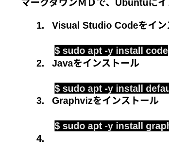
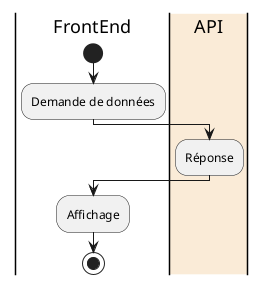

# Le widget présentation Fix

## Titre du widget

Le widget présentation Fix

## Ref.projet

   [KW-1065](https://orqual.atlassian.net/browse/KW-1065)

## Historique

| Date |     Tâches     |  
| :------------ |  :------------------ |
| le 20 Oct 2022         |   - Création de widgets, <br> - Affichage de la table, <br> - Création de table     |

## Contexte du widget

Les clients peuvent comparer les photos en définissant des attributs sur celles-ci.

En définissant un attribut pour chaque ligne et chaque colonne, le tableau peut afficher les photos que les clients souhaitent comparer.

## Positionnement stratégique

Reconstruire les fonctions déjà présentes dans Kitview sur Kitview-WEB.

Toutefois, les points suivants devraient être améliorés

- La disposition des éléments d'édition pour la définition des attributs est déroutante et ne peut pas être adaptée aux écrans mobiles.
- Définissez la taille de l'affichage de la photo de la table à la manière des autres widgets.

## Les fonctions

### 1) Le widget permettre de création de la table des attributs : saisie des valeurs par l'utilisateur

- Augmenter/réduire le nombre de colonnes
- Augmenter/réduire le nombre de lignes
- Définir les attributs des colonnes
- Définir les attributs des  lignes
- Effacer les attributs déjà saisis
- Sauvegarder les attributs saisis.*1

### 2) Le widget permettre de création les liste de méthode d'affichage

### 3) Le widget permettre d’affichage de la table

- Affichez la photo respective la plus récente correspondant le colonne et la ligne à l'attribut au table.
- Modification de l'affichage en fonction de la liste de la méthode d'affichage.

## Evolutions à venir

- L’adaptation de Diaporama
- L’adaptation de Comparateur
  
-----

## Spécification (technique)

Entrée/sortie de données lors de l'affichage



| entrée <br> (Demande) |  id_vignetteur <br> id_personne  |  sortie <br> (Réponse) | DtoStaticPresentation |
  | :------------ | :------------------: | :------------ | :------------------: |

### *1  Sauvegarder les attributs saisis

**En BDD:**

- **TYPE_COL_LIGNE**: {1 = colonne, 2 = ligne}
- **NUM_COL_LIGNE**: position ce la cellule

| ID_VIGNETTEUR |     ID_ATTRIBUT      | VALEUR | TYPE_COL_LIGNE | NUM_COL_LIGNE |
| :------------ | :------------------: | :----: | :------------: | :-----------: |
| 28            |    33 (Portrait)     |  true  |       1        |       0       |
| 28            |     38 (Profil)      |  true  |       1        |       0       |
| 29            |     42 (Droite)      |  true  |       1        |       0       |
| 29            | 110 (Lèvres jointes) |  true  |       1        |       0       |

**Affichage:**

| x             |                    0                     |               1                |           2            |
| :------------ | :--------------------------------------: | :----------------------------: | :--------------------: |
| 0 (temps = 1) | Portrait, Profil, Droite, Lèvres jointes | Portrait, Face, Lèvres jointes | Portrait, 3/4, Sourire |
| 1 (temps = 2) |                   ...                    |              ...               |          ...           |
| 2 (temps = 3) |                   ...                    |              ...               |          ...           |

## Scénario

Il ya principalement deux parties

### Editions des attributs

Tu n'auras pas d'update à faire dans la table **LINK_VIGNETTE_ATTR** cela sera ajout ou suppression

- Je veux ajouter un attribut Face (id: 40) à la colonne 0:
  J'insère l'objet suivant:

  ```json
  {
    "ID_VIGNETTEUR": 28,
    "ID_ATTRIBUT": 40,
    "VALEUR": true,
    "TYPE_COL_LIGNE": 1,
    "NUM_COL_LIGNE": 0
  }
  ```

  sois dans un tableau si je veux le sauvegarder plus tard (dépend de l'interface)

  ```ts
  const toCreateds =  [
    ...,
    {
    "ID_VIGNETTEUR": 28,
    "ID_ATTRIBUT": 40,
    "VALEUR": true,
    "TYPE_COL_LIGNE": 1,
    "
    }]
  ```

  Si tu veux identifier cet objet dans un tableau qui contiendrait toutes tes cellules (y compris ceux récupérer en db) alors tu y ajoutais une propriété `isNew: true`

- Je veux supprimer l'attribut **Profil** (id = 42) de la colonne ( TYPE_COL_LIGNE = 1) 0.
  Il n'y a pas de clé primaire dans cette table donc la condition doit être précise

```sql
DELETE FROM LINK_VIGNETTE_ATTR WHERE ID_VIGNETTEUR = 28 AND ID_ATTRIBUT = 42 AND TYPE_COL_LIGNE = 1 AND  NUM_COL_LIGNE = 0;
```

### Edition du tableaux (colonne ou ligne)

Ajout

- Je veux ajouter une colonne qui aurais les attributs Radio (id = 34) et Profil (id = 38)
  J'insère les objets suivant:

  ```json
  {
    "ID_VIGNETTEUR": 28,
    "ID_ATTRIBUT": 34,
    "VALEUR": true,
    "TYPE_COL_LIGNE": 1,
    "NUM_COL_LIGNE": 16 // prendre la dernière valeur (index) de la dernière colonne et +1 ()
  }
   {
    "ID_VIGNETTEUR": 28,
    "ID_ATTRIBUT": 38,
    "VALEUR": true,
    "TYPE_COL_LIGNE": 1,
    "NUM_COL_LIGNE": 16
  }
  ```

Tu peux mettre ça dans un tableau en une seule requête POST à toi de voir toujours pareil suivant ton interface
**Il faut penser aussi que c'est un mode édition un boutton sauvegarder est plus judicieux car on doit pouvoir se tromper comme un déssin (voir avec Mathieu)**

Le principe est le même pour ajouter une ligne des valeurs qui changes sont TYPE_COL_LIGNE = 2 (Ligne) et la position NUM_COL_LIGNE
Pour l'aspect backend bien sûr au niveau visuel à voir (copier kitview lourd peut être)

**Suppression d'une ligne / colonne**
A mon sens la seul difficulté (backend je précise ;) )

Toujours sur l'affichage précédent:

- si je supprime la ligne (TYPE_COL_LIGNE = 2) 2 (NUM_COL_LIGNE = 2) et que l'on suppose que c'est la dernière ligne du tableau (NUM_COL_LIGNE et la valeur la plus grande) alors aucun problème

Je supprime toutes les cellules de cette présentation (28) qui sont sur la dernière (NUM_COL_LIGNE = MAX) ligne (TYPE_COL_LIGNE)

```sql
DELETE FROM LINK_VIGNETTE_ATTR WHERE ID_VIGNETTEUR = 28 AND TYPE_COL_LIGNE = 2 AND NUM_COL_LIGNE = 2
```

par contre si je supprime la ligne 0 la requête est la même mais en plus de ça je dois passer sur chaque ligne supérieure à celle que je supprime et décrémenter NUM_COL_LIGNE de 1

```sql
UPDATE LINK_VIGNETTE_ATTR SET  NUM_COL_LIGNE = NUM_COL_LIGNE - 1 WHERE NUM_COL_LIGNE > 1 AND ID_VIGNETTEUR = 28 AND TYPE_COL_LIGNE = 2
```
